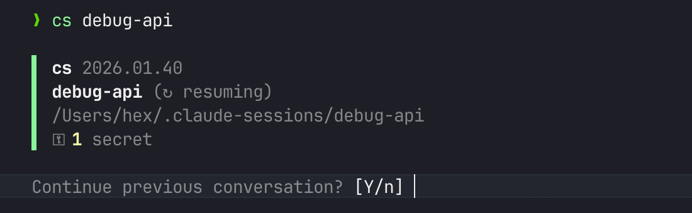

# cs - Claude Code Session Manager

A session manager for [Claude Code](https://github.com/anthropics/claude-code) that creates isolated workspaces with automatic documentation and artifact tracking.



## Why cs?

Claude Code doesn't require a project. You can spin up an instance to debug an API, troubleshoot home automation, research a hardware problem, or explore any idea that comes to mind.

But conversations get lost. You discover key insights, create useful scripts, figure out a tricky configuration - then the session ends and it's gone.

**cs gives every task a home:**

```bash
cs debug-api          # Investigate that flaky endpoint
cs homeassistant      # Fix your smart home setup
cs router-config      # Document your network settings
cs research-llms      # Explore a topic, keep your notes
```

Each session is a persistent workspace - documentation, artifacts, and secrets that survive across conversations and sync across machines.

No git repo required. No project structure needed. Just a name for what you're working on.

## Features

- **Isolated session workspaces** - Each session has its own directory with structured documentation
- **Automatic artifact tracking** - Scripts and configs are auto-saved to `artifacts/`
- **Secure secrets handling** - Sensitive data auto-detected and stored in OS keychain; sync across machines with [age](https://github.com/FiloSottile/age) public-key encryption
- **Documentation templates** - Pre-configured markdown files for discoveries and changes
- **Discoveries archival** - Automatic rotation of large discovery files before context compaction, with LLM-powered condensation via `/compact-discoveries`
- **Automatic git version control** - Every session gets local git history with auto-commits on discoveries and session end; optionally sync to remote
- **Session locking** - PID-based lock prevents the same session from being opened in two terminals simultaneously; use `--force` to override
- **Update notifications** - Checks for updates and notifies when new versions are available

## Installation

### Bash (macOS/Linux)

```bash
bash -c "$(curl -fsSL https://raw.githubusercontent.com/hex/claude-sessions/main/install.sh)"
```

Or clone and run `./install.sh`.

### PowerShell 7 (Windows/macOS/Linux)

```powershell
irm https://raw.githubusercontent.com/hex/claude-sessions/main/install.ps1 | iex
```

Or clone and run `./install.ps1`.

> :warning: Always review scripts ([bash](install.sh), [PowerShell](install.ps1)) before running them from the internet.

The installer:
- Adds `cs` and `cs-secrets` to `~/.local/bin/`
- Installs seven [hooks](docs/hooks.md) to `~/.claude/hooks/` for session tracking
- Adds `/summary` and `/compact-discoveries` commands, and `store-secret` skill to `~/.claude/`
- Installs shell completions for bash and zsh
- Configures hook entries in `~/.claude/settings.json`

## Usage

```bash
cs <session-name>           # Create or resume a session
cs <session-name> --force   # Override active session lock
cs -adopt <name>            # Adopt current directory as a session
cs -list, -ls               # List all sessions
cs -remove, -rm <name>      # Remove a session
cs -update                  # Update to latest version
cs -uninstall               # Uninstall cs
cs -help, -h                # Show help message
cs -version, -v             # Show version
```

### Session Commands

```bash
cs <session> -sync <cmd>    # Sync with git remote
cs <session> -secrets <cmd> # Manage secrets
```

### Examples

```bash
cs debug-api                # Create/resume 'debug-api' session
cs fix-auth -sync remote <url> # Initialize sync for session
cs my-project -secrets list # List secrets for session
```

### Adopting Existing Projects

Already working in a project directory with Claude Code? Use `-adopt` to add cs session management without moving anything:

```bash
cd ~/my-project
cs -adopt my-project
```

This converts the current directory into a cs session in place:
- Creates the `.cs/` metadata structure in the current directory
- Symlinks `~/.claude-sessions/<name>` to the current directory
- Merges session protocol into existing `CLAUDE.md` if one exists
- Initializes a git repo if one doesn't exist (preserves existing repos)
- Since the working directory doesn't change, `claude --continue` picks up previous conversations

## Session Structure

```
~/.claude-sessions/<session-name>/
├── .cs/                    # Session metadata
│   ├── README.md           # Objective, environment, outcome
│   ├── discoveries.md      # Recent findings and observations
│   ├── discoveries.archive.md  # Archived historical entries
│   ├── discoveries.compact.md  # LLM-condensed archive summary
│   ├── changes.md          # Auto-logged file modifications
│   ├── sync.conf           # Sync configuration
│   ├── artifacts/          # Auto-tracked scripts and configs
│   └── logs/session.log    # Session command log
├── CLAUDE.md               # Session instructions for Claude
└── [your project files]    # Clean workspace
```

## Configuration

Add to `~/.bashrc` or `~/.zshrc`:

```bash
# Sessions directory (default: ~/.claude-sessions)
export CS_SESSIONS_ROOT="/path/to/sessions"

# Git sync prefix for shorter commands
export CS_SYNC_PREFIX="git@github.com:youruser/"

# Legacy password for secrets sync (age encryption preferred - see docs/secrets.md)
export CS_SECRETS_PASSWORD="your-secure-password"

# Override secrets backend (keychain, credential, or encrypted)
export CS_SECRETS_BACKEND="keychain"

# Override Claude Code binary (default: claude)
export CLAUDE_CODE_BIN="claude"

# Use Nerd Font icons (requires a Nerd Font in your terminal)
export CS_NERD_FONTS="1"

# Disable colors (see https://no-color.org)
export NO_COLOR="1"
```

The following environment variables are set automatically when you start a session:

- `CLAUDE_SESSION_NAME` - The session name (e.g., `myproject`)
- `CLAUDE_SESSION_DIR` - Full path to the session directory (workspace root)
- `CLAUDE_SESSION_META_DIR` - Path to the `.cs/` metadata directory
- `CLAUDE_ARTIFACT_DIR` - Path to the artifacts subdirectory (`.cs/artifacts`)
- `CLAUDE_CODE_TASK_LIST_ID` - Set to the session name for task list persistence

## Shell Completion

Tab completion for session names and commands is installed automatically. To enable it:

**Bash** - Add to `~/.bashrc`:
```bash
[[ -f ~/.bash_completion.d/cs.bash ]] && source ~/.bash_completion.d/cs.bash
```

**Zsh** - Add to `~/.zshrc` (before `compinit`):
```bash
fpath=(~/.zsh/completions $fpath)
autoload -Uz compinit && compinit
```

**PowerShell** - Add to your `$PROFILE`:
```powershell
. "$HOME/.config/powershell/completions/cs.ps1"
```

Then restart your shell or run `source ~/.bashrc` / `source ~/.zshrc` / `. $PROFILE`.

Completions support:
- Session names: `cs home<TAB>` → `cs homeassistant`
- Global flags: `cs -<TAB>` → `-list`, `-sync`, `-secrets`, etc.
- Sync commands: `cs session -sync <TAB>` → `init`, `push`, `pull`, etc.
- Secrets commands: `cs session -secrets <TAB>` → `set`, `get`, `list`, etc.

## Documentation

- **[Hooks](docs/hooks.md)** - How the seven Claude Code hooks work
- **[Secrets](docs/secrets.md)** - Secure secrets handling and storage backends
- **[Sync](docs/sync.md)** - Git-based session sync across machines

## Requirements

- [Claude Code](https://github.com/anthropics/claude-code)
- Bash 4.0+ or PowerShell 7+
- `jq` for hook configuration (bash installer only; PowerShell uses native JSON)
- `git` for session sync

## Uninstalling

```bash
cs -uninstall
```

## License

MIT

## Contributing

Contributions welcome! Please open an issue or PR.
