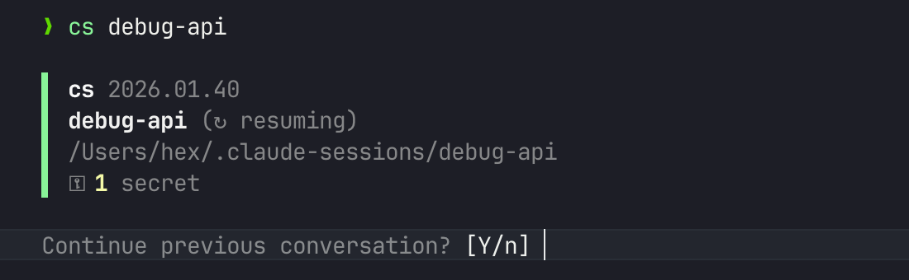
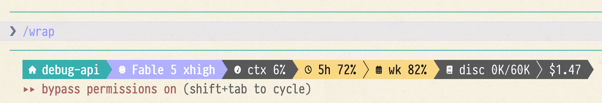

# cs - Claude Code Session Manager

A session manager for [Claude Code](https://github.com/anthropics/claude-code) that creates isolated workspaces with automatic documentation and artifact tracking.



## Why cs?

Claude Code doesn't require a project. You can spin up an instance to debug an API, troubleshoot home automation, research a hardware problem, or explore any idea that comes to mind.

But conversations get lost. You discover key insights, create useful scripts, figure out a tricky configuration - then the session ends and it's gone.

**cs gives every task a home:**

```bash
cs debug-api          # Investigate that flaky endpoint
cs homeassistant      # Fix your smart home setup
cs router-config      # Document your network settings
cs research-llms      # Explore a topic, keep your notes
```

Each session is a persistent workspace - documentation, artifacts, and secrets that survive across conversations and sync across machines.

No git repo required. No project structure needed. Just a name for what you're working on.

## Concepts

- **Sessions** — Isolated workspaces, each with their own git repo, documentation, and artifact tracking. `cs debug-api` creates one; running it again resumes it.
- **Narrative** (`.cs/memory/narrative.md`) — A lab notebook for recording findings, observations, and ideas during a session. Held as a native Claude Code memory topic file, so it inherits lazy-loading (the `MEMORY.md` index pointer loads at startup; the body is read on demand) and shows up in the `/memory` tooling.
- **Artifacts** (`.cs/artifacts/`) — Scripts and config files are automatically intercepted and saved here, tracked in a `MANIFEST.json` with metadata.
- **Checkpoints** (`.cs/checkpoints/`) — Labelled narrative snapshots you can save mid-session with `/checkpoint`, capturing the narrative, changes, and the current git HEAD.
- **Timeline** (`.cs/timeline.jsonl`) — A structured event log recording session starts, ends, and checkpoints as newline-delimited JSON.
- **Auto-memory** (`.cs/memory/`) — Claude Code's persistent operational notes, redirected into the session so they sync across machines and get cleaned up with `cs -rm`.

## Features

- **Isolated session workspaces** - Each session has its own directory with structured documentation
- **Automatic artifact tracking** - Scripts and configs are auto-saved to `artifacts/`
- **Secure secrets handling** - Sensitive data auto-detected and stored in OS keychain; sync across machines with [age](https://github.com/FiloSottile/age) public-key encryption
- **Documentation templates** - Pre-configured markdown files for the session narrative and outcome
- **Automatic git version control** - Every session gets local git history; narrative edits are autosaved to a shadow ref for crash safety, session end creates one clean commit; optionally sync to remote
- **Session locking** - PID-based lock prevents the same session from being opened in two terminals simultaneously; use `--force` to override
- **Deterministic Claude-session resume** - Each session pre-allocates a UUID at creation and records it in `.cs/README.md` frontmatter; `cs <name>` resumes via `claude --resume <uuid>` (the exact conversation) rather than `--continue` (the most-recent claude conversation, which can be a sibling). Hooks read `$CS_CLAUDE_SESSION_ID`; `cs -doctor` cross-checks the recorded UUID against the live `$CLAUDE_CODE_SESSION_ID`. A `ps`-based guard refuses to spawn a second claude for the same UUID (`--force` overrides). Legacy sessions bind to their existing claude transcript on next launch via `migrate_session` Phase 8 — the recorded UUID is discovered from `~/.claude/projects/<encoded-cwd>/` rather than minted blind, and an orphaned recorded UUID (one with no matching transcript file) is self-healed to the most-recent real transcript. Declining the resume prompt (`N`) rebinds the session to a fresh UUID and passes `--session-id <new>` to claude so the fresh conversation stays tracked, with `CS_FRESH_REBIND=1` signalling SessionStart hooks to inject a "clean break, lazy-read .cs/ for context" notice instead of acting like a cold-start. Every launch also passes `--name <session>` so cs's session name appears in claude's prompt-box badge, `/resume` picker, and terminal title; and a random color (one of `red blue green yellow purple orange pink cyan`) is allocated at session creation and stored in frontmatter as `claude_session_color`, re-applied at every launch via a `/color $color` positional prompt so parallel sessions stay visually distinct. Legacy sessions without a color get one backfilled on next launch via `migrate_session` Phase 11.
- **Per-session memory path redirect** - cs exports `CLAUDE_COWORK_MEMORY_PATH_OVERRIDE` so claude's built-in auto-memory writer lands durable facts in `<session>/.cs/memory/` instead of the default `~/.claude/projects/<encoded-cwd>/memory/`. The harness owns the writing (file naming, frontmatter, MEMORY.md index updates); cs owns only the storage path + a one-line `<!-- cs:memory-note -->` disclosure in CLAUDE.md describing the redirect. The prior `cs:memory-rules` block (an imperative bucket-guidance doctrine shipped in v2026.5.2) was retired in v2026.5.5 after an audit showed claude's harness writes memory files autonomously regardless of cs's prose — see CHANGELOG for the retirement rationale. Phase 9 lazy-migrates existing sessions: legacy rules blocks (v1 or v2) are stripped and replaced with the note in place; tombstone opt-outs are preserved.
- **Remote sessions** - Run sessions on remote machines via `et` or `ssh` + `tmux`; `cs` handles connection, stubbing, and session tracking
- **Cross-session search** - `cs -search <query>` greps across all sessions' narrative, memory, and README
- **Prose hygiene enforcement** - `cs -lint <file>` flags AI-slop tells (em-dashes, a curated banned-phrase list) outside code fences; the `prose-lint` Stop hook blocks turn-end when prose written this session (`.cs/summary.md`, `.cs/memory/*.md`) carries them, scoped by `session.lock` mtime so it never re-flags the historical backlog. `/summary` and `/wrap` add an independent structural-quality judge: a subagent that reads the `prose-hygiene` skill (the complete AI-tell taxonomy: phrases, structures, voice rules, and a five-dimension rubric) and applies all of it, catching the slop a regex cannot. Single-word adverbs and lazy extremes are judge-only by design, since they occur in nearly all legitimate prose
- **Auto-grounded scope** - `/scope` (UserPromptSubmit hook) classifies each user prompt and, on a positive (code-work) classification, injects a bounded `Scope (auto-grounded)` block as `additionalContext`: matching tracked files + recent commits + working-tree diff, all derived from `git ls-files` and a hybrid token matcher (ordered substring for path-like tokens, component-equality with camelCase splitting for bare-word tokens). Excludes `node_modules/`, `target/`, `dist/`, `build/`, `.next/`, `coverage/`, `.cs/`, `.git/`. Capped at 8000 bytes. Opt out per-session via `CS_SCOPE_DISABLE=1`. No caching — a grounding hook must reflect the current tree, so the scan runs on every fire (~50-150ms bounded). Negative classifications pass through silently.
- **Status line** - `cs-statusline` renders Claude Code's status bar as one line of squared, abutting pills: session name tinted with the session's `claude_session_color`, git branch (bold slate-blue accent) with ahead/behind and dirty counts, model + effort level, context %, 5-hour/weekly rate limits (the 5-hour block also shows the time until the window resets), and session cost. Everything comes from the status-line stdin JSON plus one bounded git call (`GIT_OPTIONAL_LOCKS=0`, 2s timeout) and one small `.cs/` read; no transcript parsing, no network, no writes. `install.sh` only registers it in `settings.json` with confirmation (and never replaces an existing status line without asking); enable or remove it any time with `cs -statusline enable|disable`. Choose and order segments with `CS_STATUSLINE_SEGMENTS`, disable with `CS_STATUSLINE_DISABLE=1`, tune thresholds with `CS_STATUSLINE_CTX_WARN`/`CS_STATUSLINE_CTX_CRIT`; outside cs sessions the cs-only segments go blank. cs detects the terminal's light/dark theme at launch via an OSC 11 background query (inside tmux the query is sent through DCS passthrough so it reaches the real outer terminal; requires `allow-passthrough on`, falling back to the macOS appearance otherwise) and exports it as `CS_TERM_THEME`, which also acts as a manual override; `cs -detect-theme` shows the result. See [docs/statusline.md](docs/statusline.md)

  
- **Health checks** - `cs -doctor` reports status of Keychain backend, hook registration, git sync state, shadow-ref freshness, auto-memory writability, status line registration, Claude Code settings audit (hooks/MCPs/permissions/env vars counts), and cumulative token usage for the current project
- **Bash command audit trail** - Every Bash command Claude runs is logged to `.cs/logs/session.log` with timestamps
- **Update notifications** - Checks for updates and notifies when new versions are available
- **Verified updates** - Updates are downloaded from GitHub Releases and verified with SHA-256 checksums; additionally verified with [minisign](https://jedisct1.github.io/minisign/) signatures when available

## Installation

### Bash (macOS/Linux)

```bash
bash -c "$(curl -fsSL https://raw.githubusercontent.com/hex/claude-sessions/main/install.sh)"
```

Or clone and run `./install.sh`.

> :warning: Always review [install.sh](install.sh) before running scripts from the internet.

The installer:
- Adds `cs`, `cs-secrets`, and `cs-tui` to `~/.local/bin/`
- Installs eleven [hooks](docs/hooks.md) to `~/.claude/hooks/cs/` for session tracking (including the `/scope` auto-grounding hook on UserPromptSubmit)
- Adds `/summary`, `/checkpoint`, `/sweep`, and `/wrap` commands, and the `store-secret` and `prose-hygiene` skills to `~/.claude/`
- Installs shell completions for bash and zsh
- Configures hook entries in `~/.claude/settings.json`

## Usage

```bash
cs                          # Interactive session manager (TUI)
cs <session-name>           # Create or resume a session
cs <session-name> --force   # Override active session lock
cs -adopt <name>            # Adopt current directory as a session
cs -remote <cmd>            # Manage remote hosts
cs -search <query>          # Search across all sessions
cs -doctor, -diag           # Run health checks (Keychain, hooks, sync, memory, audit, leaks, tokens)
cs -lint <file>...          # Flag AI-slop prose tells (em-dashes, banned phrases); 0 clean 1 issues 2 error
cs -list, -ls               # List all sessions
cs -remove, -rm <name>      # Remove a session
cs -update                  # Update to latest version
cs -uninstall               # Uninstall cs
cs -help, -h                # Show help message
cs -version, -v             # Show version
```

### Interactive Session Manager

Running `cs` with no arguments launches an interactive TUI for browsing and managing sessions:

- **Navigate** with `j`/`k` or arrow keys; `g`/`G` for first/last; mouse scroll and click supported
- **Sort** by column with `1`-`6` (toggles ascending/descending)
- **Fuzzy search** with `/` — matches characters in order with highlighting; Enter commits the filter
- **Time-based sections** — sessions grouped under Today, Yesterday, This Week, This Month, Older when sorted by date
- **Action bar** with `Enter` — inline bar shows available actions with shortcut keys
- **Preview pane** — appears automatically on wide terminals (>120 cols); toggle with `p`
- **Expand row** with `Tab` — shows session objective (auto-captured from your first prompt), narrative, and artifact count inline
- **Create session** with `n` — opens inline dialog to create a new session
- **Delete** with `d` (confirmation required)
- **Batch operations** — mark sessions with `Space`, then `D` to batch delete
- **Rename** with `r`
- **Move to remote** with `m` (local sessions only)
- **Manage secrets** with `s` (view values with `v`, auto-redacts after 5 seconds)
- **Async sync** with `P` (push), `L` (pull), `S` (status) — runs in background with spinner; `Esc` to cancel
- **Quit** with `q` or `Esc`
- **Light/dark palette** — the warm palette adapts to the terminal background detected at launch (`CS_TERM_THEME`); set the env var to force `light` or `dark`

The TUI requires `cs-tui` (an ~820 KB Rust binary). Build from source: `cd tui && cargo build --release`.

### Session Commands

```bash
cs <session> -sync, -s <cmd>  # Sync with git remote
cs <session> -secrets <cmd>   # Manage secrets
cs <session> --on <host>      # Run on remote host
cs <session> --move-to <host> # Move session to remote host
cs <session> --force          # Override active session lock
```

### Examples

```bash
cs debug-api                # Create/resume 'debug-api' session
cs fix-auth -sync remote <url> # Initialize sync for session
cs my-project -secrets list # List secrets for session
```

### Adopting Existing Projects

Already working in a project directory with Claude Code? Use `-adopt` to add cs session management without moving anything:

```bash
cd ~/my-project
cs -adopt my-project
```

This converts the current directory into a cs session in place:
- Creates the `.cs/` metadata structure in the current directory
- Symlinks `~/.claude-sessions/<name>` to the current directory
- Merges session protocol into existing `CLAUDE.md` if one exists
- Initializes a git repo if one doesn't exist (preserves existing repos)
- Since the working directory doesn't change, `claude --continue` picks up previous conversations

### Remote Sessions

Run sessions on a remote machine (e.g., a Mac Mini build server) while keeping `cs SESSION_NAME` as your single entry point. The remote machine needs `cs` and Claude Code installed independently.

**Register a remote host (one-time):**

```bash
cs -remote add mini hex@mac-mini.local
cs -remote list
cs -remote remove mini
```

**Create or connect to a remote session:**

```bash
cs my-session --on mini                # using registered name
cs my-session --on hex@mac-mini.local # inline, no registration needed
cs hex@mac-mini.local:my-session      # host:session syntax (auto-remembered)
```

After the first connection, `cs my-session` automatically reconnects to the remote host.

**Move an existing local session to remote:**

```bash
cs my-session --move-to mini
```

This rsyncs the session to the remote host and creates a local stub so future `cs my-session` calls connect remotely.

**Transport:** Prefers [Eternal Terminal](https://eternalterminal.dev/) (`et`) when available, falls back to `ssh`. Sessions are wrapped in `tmux` on the remote side.

**Listing:** `cs -ls` shows a LOCATION column when remote sessions exist.

**Note:** `-sync` and `-secrets` commands are not available on remote sessions. Connect to the remote session first, then run them from within.

## Session Structure

```
~/.claude-sessions/<session-name>/
├── .cs/                    # Session metadata
│   ├── README.md           # Objective, environment, outcome
│   ├── sync.conf           # Sync configuration
│   ├── remote.conf         # Remote host (if remote session)
│   ├── memory/             # Claude Code auto memory + narrative.md lab notebook (synced)
│   ├── plans/              # Claude Code plans (synced)
│   ├── timeline.jsonl      # Session event log (starts, ends, checkpoints)
│   ├── artifacts/          # Auto-tracked scripts and configs
│   └── logs/session.log    # Bash command audit trail + session log
├── .claude/
│   └── settings.local.json # Redirects auto memory into .cs/memory
├── CLAUDE.md               # Session instructions for Claude
└── [your project files]    # Clean workspace
```

Claude Code's [auto memory](https://code.claude.com/docs/en/memory) is redirected into `.cs/memory/` via the `CLAUDE_COWORK_MEMORY_PATH_OVERRIDE` env var (set at launch). This means auto memory is synced across machines with `cs -sync` and cleaned up with `cs -rm`.

## Slash Commands

- `/wrap` — The canonical end-of-session command: runs the `/sweep` memory pass, then the `/summary` narrative, then the prose gate
- `/sweep` — Distill the session into durable auto-memory entries (strict bar) and sweep findings into the narrative
- `/summary` — Generate a narrative summary of the current session
- `/checkpoint <label>` — Save a labelled state snapshot (narrative, changes, git HEAD)

## Configuration

Add to `~/.bashrc` or `~/.zshrc`:

```bash
# Sessions directory (default: ~/.claude-sessions)
export CS_SESSIONS_ROOT="/path/to/sessions"

# Git sync prefix for shorter commands
export CS_SYNC_PREFIX="git@github.com:youruser/"

# Legacy password for secrets sync (age encryption preferred - see docs/secrets.md)
export CS_SECRETS_PASSWORD="your-secure-password"

# Override secrets backend (keychain or encrypted)
export CS_SECRETS_BACKEND="keychain"

# Override Claude Code binary (default: claude)
export CLAUDE_CODE_BIN="claude"

# Nerd Font icons in cs banners and session listings (lock, sync, home);
# the status line uses standard Unicode and is unaffected by this
export CS_NERD_FONTS="1"

# Force the light/dark theme (session-picker TUI palette, statusline, hooks).
# Unset (default), cs auto-detects the terminal background before launch
# (OSC 11 with tmux passthrough, macOS appearance, then COLORFGBG). Set this
# to override; `cs -detect-theme` prints what detection yields.
export CS_TERM_THEME="light"   # or "dark"

# Disable colors (see https://no-color.org)
export NO_COLOR="1"

# Status line: choose/order segments, or disable entirely
export CS_STATUSLINE_SEGMENTS="session,git,model,ctx,limits,cost"
export CS_STATUSLINE_DISABLE="1"
```

The following environment variables are set automatically when you start a session:

- `CLAUDE_SESSION_NAME` - The session name (e.g., `myproject`)
- `CLAUDE_SESSION_DIR` - Full path to the session directory (workspace root)
- `CLAUDE_SESSION_META_DIR` - Path to the `.cs/` metadata directory
- `CLAUDE_ARTIFACT_DIR` - Path to the artifacts subdirectory (`.cs/artifacts`)
- `CLAUDE_CODE_TASK_LIST_ID` - Set to the session name for task list persistence

## Shell Completion

Tab completion for session names and commands is installed automatically. To enable it:

**Bash** - Add to `~/.bashrc`:
```bash
[[ -f ~/.bash_completion.d/cs.bash ]] && source ~/.bash_completion.d/cs.bash
```

**Zsh** - Add to `~/.zshrc` (before `compinit`):
```bash
fpath=(~/.zsh/completions $fpath)
autoload -Uz compinit && compinit
```

Then restart your shell or run `source ~/.bashrc` / `source ~/.zshrc`.

Completions support:
- Session names: `cs home<TAB>` → `cs homeassistant`
- Global flags: `cs -<TAB>` → `-list`, `-sync`, `-secrets`, etc.
- Sync commands: `cs session -sync <TAB>` → `remote`, `push`, `pull`, etc.
- Secrets commands: `cs session -secrets <TAB>` → `set`, `get`, `list`, etc.

## Documentation

- **[Hooks](docs/hooks.md)** - How the Claude Code hooks work
- **[Secrets](docs/secrets.md)** - Secure secrets handling and storage backends
- **[Statusline](docs/statusline.md)** - The cs status line: segments, colors, configuration
- **[Sync](docs/sync.md)** - Git-based session sync across machines

## Obsidian Integration

Open `~/.claude-sessions/` (or your `CS_SESSIONS_ROOT`) as an [Obsidian](https://obsidian.md) vault for a visual dashboard over all sessions.

**What works out of the box:**
- Full-text search across all sessions
- Graph view showing session connections via standard markdown links
- `index.md` at the vault root listing all sessions (auto-generated on session end)
- YAML frontmatter in each session's `.cs/README.md` with `status`, `created`, `updated`, `tags`, and `aliases`

**Recommended plugins:**
- **[Dataview](https://github.com/blacksmithgu/obsidian-dataview)** - Query sessions by frontmatter (status, tags, dates)
- **[Projects](https://github.com/marcusolsson/obsidian-projects)** - Kanban/calendar views over session frontmatter
- **[Juggl](https://github.com/HEmile/juggl)** - Graph views from YAML relationships (no wikilinks needed)

**Example Dataview queries** (paste into any note):

Active sessions sorted by last activity:
````markdown
```dataview
TABLE status, tags, last_resumed
FROM "."
WHERE file.name = "README" AND status = "active"
SORT last_resumed DESC
```
````

Stale sessions (not touched in 7+ days):
````markdown
```dataview
LIST
FROM "."
WHERE file.name = "README" AND status = "active"
  AND last_resumed <= date(today) - dur(7 days)
```
````

**Graph view tip:** In Obsidian's graph settings, add `.cs/artifacts` and `.cs/logs` to the folder exclusion filter to reduce clutter.

## Requirements

- [Claude Code](https://github.com/anthropics/claude-code)
- Bash 3.2+ (macOS system bash supported)
- `jq` for hook configuration
- `git` for session sync

## Uninstalling

```bash
cs -uninstall
```

## See also

- [iTerm2-dimmer](https://github.com/hex/iTerm2-dimmer) -- dims noisy hook output (TASKMASTER, prose-lint) in iTerm2 so it doesn't clutter the screen

## License

MIT

## Contributing

Contributions welcome! Please open an issue or PR.
