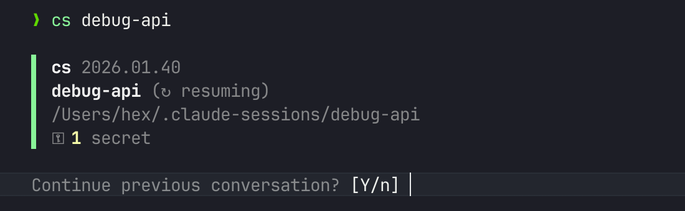
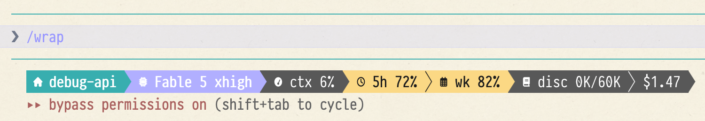

# cs - Claude Code Session Manager

[](https://github.com/hex/claude-sessions/actions/workflows/test.yml)

A session manager for [Claude Code](https://github.com/anthropics/claude-code) that creates isolated workspaces with automatic documentation.



## Why cs?

Claude Code doesn't require a project. You can spin up an instance to debug an API, troubleshoot home automation, research a hardware problem, or explore any idea that comes to mind.

But conversations get lost. You discover key insights, create useful scripts, figure out a tricky configuration - then the session ends and it's gone.

**cs gives every task a home:**

```bash
cs debug-api          # Investigate that flaky endpoint
cs homeassistant      # Fix your smart home setup
cs router-config      # Document your network settings
cs research-llms      # Explore a topic, keep your notes
```

Each session is a persistent workspace - documentation and secrets that survive across conversations.

No git repo required. No project structure needed. Just a name for what you're working on.

## Features

### Session workspaces

- **Isolated session workspaces** - Each session has its own directory with structured documentation
- **Documentation templates** - Pre-configured markdown files for the session narrative and outcome
- **Automatic git version control** - Every session gets a local git repo; in-session edits are autosaved to a shadow ref for crash recovery
- **Session locking** - PID-based lock prevents the same session from being opened in two terminals simultaneously; use `--force` to override. cs also treats a session as live when its statusline heartbeat is fresh — in the TUI (`■ live · unlocked`), `cs -live`, and the `cs -usage` marker — so a conversation opened outside cs still registers as live. The destructive guards (`cs -rm`/`-archive`/`-spawn`) stay on the strict PID lock, so a session whose process is gone is still removable without `--force`
- **Deterministic Claude-session resume** - Each session pre-allocates a conversation UUID in the gitignored `.cs/local/state`, so `cs <name>` resumes the *exact* conversation via `claude --resume <uuid>`, not the most-recent one `--continue` might pick from a sibling. A `ps`-based guard refuses to launch a second claude for the same conversation (`--force` overrides), and every launch passes `--name` plus a per-session `/color` so parallel sessions stay visually distinct.
- **Per-session memory path redirect** - cs points Claude Code's built-in auto-memory writer at `<session>/.cs/memory/` (via `CLAUDE_COWORK_MEMORY_PATH_OVERRIDE`) so durable facts land in the session instead of the global project store. The harness owns how memory files are written (naming, frontmatter, `MEMORY.md` index); cs owns only the storage path.
- **Conversation rotation** - a heavy conversation can hand off to a fresh one without losing context: the `rotate` skill (self-invoked, or nudged once per conversation past 80% context) writes a lineage-stamped handoff to `.cs/handoffs/` and arms it, then `/clear` continues from it without leaving Claude Code. Exiting and answering `r` at the next `cs <name>` launch does the same; `d` discards the handoff. `cs -conversations` shows the resulting chain.
- **Works outside the `cs` launcher** - a session is any directory containing `.cs/`, so the hooks find it whether `cs <name>` started the conversation or you opened the folder in a front end that cannot export environment into it — Claude Code desktop, an IDE, a plugin. A terminal is the exception, because there a session is entered by running `cs`: `claude` typed in a session directory stays cs-blind. `cs` still owns creating sessions and the launch experience (resume prompt, rotation menu, statusline, tmux spawner); what carries over is the documentation, narrative, timeline, autosave, and scope grounding. The session's recorded conversation stays with the `cs` launch, so a conversation opened another way — or a teammate claude working in the same folder — contributes to the session without becoming the one `cs <name>` resumes. When one of those is newer than the recorded conversation, the next launch says so and names it, rather than resuming the older one in silence:

  ```
  A newer conversation was opened here outside cs: 11111111-2222-4333-8444-555555555555
  Resuming the recorded one instead. To continue the newer: claude --resume 11111111-2222-4333-8444-555555555555
  ```

  Drop `.cs/local/disabled` into a session to opt it out.

### Prompt and writing aids

- **Prose hygiene** - the `prose-hygiene` skill carries the full AI-slop taxonomy (phrases, structures, voice rules) that no regex can catch; `/summary` applies it with a subagent judge that scores `.cs/summary.md` and returns concrete rewrites. See [skills/prose-hygiene/SKILL.md](skills/prose-hygiene/SKILL.md)
- **Auto-grounded scope** - On each code-work prompt, the `scope-prompt` hook injects a bounded context block — matching tracked files, recent commits, and a working-tree diff — grounding Claude in the current codebase before it acts. Capped at 8000 bytes; opt out per-session with `CS_SCOPE_DISABLE=1`. Each run also appends a stage trace to the machine-local `.cs/local/scope-prompt.trace`, so a run the hook's timeout kills leaves a trail naming the stage it hung on; opt out with `CS_SCOPE_TRACE_DISABLE=1`. The same hook asks Claude to question an ambiguous request rather than guess at it; skip one turn with a leading `~`, or the session with `CS_CLARIFY_DISABLE=1`. See [docs/hooks.md](docs/hooks.md)
- **Prompt rewriting** - Type a rough prompt, press `ctrl+g`, and the composer holds a precise engineering request you can review, edit and send. cs points `$EDITOR` at a rewrite shim, so Claude Code's own external-editor round-trip does the substitution; nothing is sent on your behalf, and every failure leaves your text exactly as typed. Claude Code blanks the interface for the round-trip, so the shim fills that screen: your prompt held in a margin rule that breathes while the rewrite runs, the engine and model answering it, and the time left against the timeout — shown only where something actually enforces one. `CS_REWRITE_PROGRESS` picks the style — `screen`, a `native` line in Claude Code's own idiom, a bare centred `line`, or a `static` one-liner. Nothing interrupts a rewrite from the keyboard — the terminal sends `ctrl+c` to Claude Code too, ending the session — so the timeout is the only bound. `CS_REWRITE_PROVIDER=openai` or `=gemini` rewrites with that vendor instead: each prefers its CLI when the binary is on PATH (`codex`, `agy`, on your subscription) and falls back to the vendor's API when it is not. Append `-api` (`gemini-api`, `openai-api`) to reach the API past an installed CLI, which is roughly eight times faster and the only way to Gemini's lite tier; `claude-api` calls Anthropic's Messages endpoint rather than driving Claude Code. `CS_REWRITE_PROVIDER=grok` reaches xAI's OpenAI-compatible endpoint on `XAI_API_KEY` or `GROK_API_KEY` — API-only, since xAI ships no rewriter CLI to prefer — defaulting to `grok-4.3`, the fastest xAI model measured that never resolved an unspecified thing by fiat. `CS_REWRITE_MODEL` sets the model on every arm. Opt out with `CS_REWRITE_DISABLE=1`. See [docs/hooks.md](docs/hooks.md)
- **Voice drafting** - `/write-as-me` drafts messages, replies, PR text, or docs in your own writing voice. On first use it distills your typed messages from Claude Code transcripts into an editable profile at `~/.claude-sessions/.voice/profile.md`; drafting loads the profile and writes as you.

### Managing many sessions

- **Agent state** - `cs -live` and the TUI's `state` row show what Claude Code says each session is doing right now — `busy`, `waiting`, `idle` — read from the per-session records Claude Code publishes under `~/.claude/sessions/`. A record outlives a crash, so cs believes one only while its pid is alive and still reports the process start time the record holds; otherwise a recycled pid would keep a dead session looking busy. Hosts that publish no records (Claude Code before 2.1.224, or without `jq` for the shell reader) simply show no state
- **Cross-session search** - `cs -search <query>` greps across all sessions' narrative, memory, and README
- **Health checks** - `cs -doctor` reports status of Keychain backend, hook registration, shadow-ref freshness, auto-memory writability, status line registration, Claude Code settings audit (hooks/MCPs/permissions/env vars counts), and cumulative token usage for the current project
- **Usage attribution** - `cs -usage` shows which sessions are consuming the 5-hour and weekly rate-limit windows: per-session input/output token sums (deduplicated by API request, cache-read excluded), anchored at the true reset boundaries when the cs status line is active. `cs -usage <name>` breaks one session down per conversation with a lifetime column.
- **Session tags** - `cs -tag add api` tags the current session in its README frontmatter (`tags: [api]` — the same field Obsidian indexes); `cs -list --tag api` filters the listing, and the picker filters live with `#api` in the search query (combining with fuzzy name search). Tags show in the preview card.
- **Session archive** - `cs -archive <name>` drops a tracked `.cs/archived` marker that hides a finished session from the picker, `cs -list`, and `cs -search` (the marker syncs with the session, so archiving on one machine archives everywhere). `cs -list --archived` lists only archived sessions, `cs -search <q> --include-archived` searches them, and the picker toggles visibility with `A` (archived rows render dimmed) and archives or unarchives the selected session with `a`. Opening an archived session unarchives it.

### Unattended and multi-agent work

- **Walk-away supervision** - a draining queue is watched by circuit breakers: too many tool failures in one task (default 5, `CS_QUEUE_MAX_FAILURES`), context past 85% (`CS_QUEUE_MAX_CTX`), or the 5-hour rate-limit window past 85% (`CS_QUEUE_MAX_5H`) parks the queue with a debrief instead of feeding the next task — nothing is lost, `cs -queue start` re-arms. Everything that happened while you were away (tasks done, breaker trips) lands in a per-machine journal: a one-line digest surfaces once on your return, and `cs -queue log` shows the full history.
- **Cross-session mail** - `cs -msg <session> "note"` drops a message in another session's machine-local mailbox (`--kind notify|task|text|result`; `task` also lands in its walk-away queue). Delivery is atomic — each message is its own file, written whole and renamed into place, so concurrent senders can never interleave. Bodies may be up to 64KB, and a lone `-` body reads from stdin (`cs -msg <session> -`). The recipient sees the unread bodies inlined into its context on every prompt until it reads them with `cs -msg` (bounded to 5, truncated; `task` kind shows a count-only label since it is already queued). Same-machine only; attribution is unauthenticated by design.
- **Threads** - every message carries a thread id, and the sender keeps its own copy, so an exchange can be re-read from either end — including after a rotation, when an agent otherwise has no way to find out what it already said. `cs -msg --reply <thread> "body"` answers without naming the peer (it comes from the thread; naming a different one is an error, not an override), and `cs -msg thread <id>` prints the conversation ordered by what answers what — not by time, since a question and its reply usually land in the same whole second.
- **Mail wakes** - unread mail takes a turn instead of waiting for a keystroke, so agent-to-agent work advances unattended. A session that just finished a turn is woken at that boundary; a session already parked at the prompt is woken by Claude Code's file watcher noticing the delivery, which arrives as a system-reminder rather than as synthesised typing. Either way the wake names who the new mail is from, so the woken session knows its correspondent before it opens the mailbox. Fires once per arrival, never for `task` kind (the queue owns those), never while a walk-away drain is running, and only in the launched conversation — not in teammates sharing the mailbox. Bounded by `CS_MAIL_WAKE_MAX` (default 5) wakes between prompts so two sessions cannot volley forever; `CS_NO_MAIL_WAKE=1` silences it without swallowing the message.
- **tmux spawner** - `cs -spawn <name>` opens a session in a cs-owned tmux session (`tmux attach -t cs`); `--task "..."` seeds and arms its walk-away queue so it starts working unattended, and the spawner hears back over cross-session mail when the queue drains. Same-machine only.

### Terminal experience

- **Status line** - `cs-statusline` renders Claude Code's status bar as one line of squared pills: a Claude logo badge (pulsing until your next prompt), the session name in its `/color`, a queued-task count, an unread cross-session mail count, git branch with ahead/behind and dirty counts, model + effort, context %, and 5-hour/weekly rate limits (each gaining a reset countdown as it fills) — all from the status-line JSON plus one bounded git call, with no transcript parsing. On a Fable session it adds a `fable` chip for Fable's own weekly window, which is model-scoped and so appears in none of the rate limits Claude Code puts on stdin; that one figure is fetched out of band into a machine-global cache, never from the render, and only while Fable is the active model — using Claude Code's own credential, which cs reads and never writes. It writes two machine-local files as it renders — `.cs/local/context-pct` and `.cs/local/limits` — which is what makes the liveness heartbeat and `cs -usage`'s reset anchoring work. Session cost is available as an opt-in segment. Enable or remove it any time with `cs -statusline enable|disable`; choose and order segments with `CS_STATUSLINE_SEGMENTS`. cs auto-detects the terminal's light/dark theme (override with `CS_TERM_THEME`; `cs -detect-theme` shows the result). A companion `cs-subagent-statusline` styles the agent-panel rows so each running subagent shows the model driving it, its own context %, and elapsed time; `cs -statusline enable` registers both (Claude Code reads the registration at startup, so restart it to see them). See [docs/statusline.md](docs/statusline.md)

  
- **iTerm2 awareness** - inside iTerm2 the session color tints the tab (native escapes, reset on exit), and with iTerm2 shell integration installed a finished turn bounces the dock until your next prompt. `CS_NO_ITERM2=1` disables the bounce; `cs -doctor` reports the integration surface.

### Security and trust

- **Secure secrets handling** - Store sensitive data in the OS keychain (value read from stdin, never written to a file); exportable as [age](https://github.com/FiloSottile/age)-encrypted files for backup
- **Bash command audit trail** - Every Bash command Claude runs is logged to `.cs/local/session.log` (machine-local, never git-synced) with timestamps
- **Update notifications** - Checks for updates and notifies when new versions are available. When an update is pending, cs shows the release notes for every version above the installed one: a compact summary card in the launch banner, and the full notes under `cs -update --check`.
- **Verified updates** - Updates are downloaded from GitHub Releases and verified with SHA-256 checksums; additionally verified with [minisign](https://jedisct1.github.io/minisign/) signatures when available


## Requirements

- [Claude Code](https://github.com/anthropics/claude-code)
- Bash 3.2+ (macOS system bash supported)
- `jq` for hook configuration
- `git` for local session history and crash recovery
- Windows: WSL2 (see [Installation → Windows](#windows)); native Windows and Git Bash are not supported

## Installation

### Bash (macOS/Linux)

```bash
bash -c "$(curl -fsSL https://raw.githubusercontent.com/hex/claude-sessions/main/install.sh)"
```

Or clone and run `./install.sh`.

> :warning: Always review [install.sh](install.sh) before running scripts from the internet.

The installer:
- Adds `cs`, `cs-secrets`, `cs-statusline`, `cs-subagent-statusline`, and `cs-tui` to `~/.local/bin/`
- Installs the cs [hooks](docs/hooks.md) to `~/.claude/hooks/cs/` for session tracking (including the `scope-prompt` auto-grounding hook on UserPromptSubmit)
- Adds `/summary`, `/checkpoint`, `/sweep`, and `/wrap` commands, and the `store-secret`, `prose-hygiene`, `rotate`, `merge`, and `write-as-me` skills to `~/.claude/`
- Installs shell completions for bash and zsh
- Configures hook entries in `~/.claude/settings.json`

### Windows

Install inside a WSL2 distro exactly as on Linux (the command above). cs targets macOS and Linux; native Windows and Git Bash are not supported.

The platform is detected automatically. It decides one thing — whether secrets go to the macOS keychain or to an encrypted file — and `CS_PLATFORM_OVERRIDE=macos|wsl|linux` forces that choice for testing. Any other value is refused rather than treated as "not macOS".

## Concepts

- **Sessions** — Isolated workspaces, each with their own git repo and documentation. `cs debug-api` creates one; running it again resumes it.
- **Narrative** (`.cs/memory/narrative.<actor>.md`) — A per-actor lab notebook for findings, observations, and ideas during a session. Each co-developer writes their own file (so shared sessions never conflict) and everyone reads all of them on resume. Stored as native Claude Code memory files; see [docs/session-layout.md](docs/session-layout.md) for how that works.
- **Checkpoints** (`.cs/checkpoints/`) — Labelled narrative snapshots you can save mid-session with `/checkpoint`, capturing the narrative, changes, and the current git HEAD.
- **Timeline** (`.cs/timeline.jsonl`) — A structured event log recording session starts, ends, and checkpoints as newline-delimited JSON.
- **Auto-memory** (`.cs/memory/`) — Claude Code's persistent operational notes, redirected into the session and cleaned up with `cs -rm`.

## Usage

```bash
cs                          # Open the session you are standing in, else the session manager (TUI)
cs -tui                     # Interactive session manager, from anywhere
cs -- <session-name>        # '--' ends the options, for launchers that insert one
cs <session-name>           # Create or resume a session
cs <session-name> --force   # Override active session lock
cs <base>@<feature>         # Create/resume a parallel feature worktree off <base>
cs <base> --merge <feature> # Merge a feature worktree back into <base>
cs <base> -features         # List a base's feature worktrees and their merge readiness
cs <base> -finish <feature> # Open <base> and run the merge ritual for <feature>
cs -adopt <name>            # Adopt current directory as a session
cs -whoami                  # Show the current actor (for shared, multi-person sessions)
cs -who                     # Show who contributed to shared memory/narrative (git history)
cs -search <query>          # Search across all sessions
cs -checkpoint "<label>"    # Snapshot git state + narrative (also: list, show <name>)
cs -queue add "<task>"      # Walk-away task queue (also: list, rm <n>, clear, log)
cs -msg <session> "note"    # Send mail to another session (--kind notify|task|text|result; '-' body reads stdin); bare cs -msg reads
cs -msg --reply <thread> "note"  # Reply into a thread; the target comes from the thread
cs -msg thread <id>         # Show one thread as a conversation, oldest first
cs -msg log                 # This session's full mail history, sent and received
cs -spawn <name> [--task ..]  # Open a session in a cs-owned tmux window; --task arms its walk-away queue
cs -doctor, -diag           # Run health checks (Keychain, hooks, memory, audit, tokens)
cs -usage [--all] [<name>]  # Per-session token usage over the 5h/weekly rate-limit windows
cs -tag add|rm <tag>        # Tag the current session (also: cs <name> -tag ..., -tag list)
cs -list --tag <tag>        # List only sessions carrying a tag
cs -archive <name>...       # Archive sessions (hidden from listings; --force if live)
cs -unarchive <name>...     # Restore archived sessions
cs -list --archived         # List only archived sessions
cs -statusline enable|disable  # Enable or remove the cs status line + agent-panel rows
cs -detect-theme            # Show the detected terminal light/dark theme
cs -list, -ls               # List all sessions
cs -live                    # List sessions running right now on this machine, with what each is doing
cs -status "<text>"         # Set this session's status (also: cs -status, cs -status --clear)
cs -remove, -rm <name>...   # Remove sessions (each asks its own confirm; --force if live)
cs -update [--check|--force]   # Update to latest (--check: check only; --force: reinstall)
cs -uninstall               # Uninstall cs
cs -help, -h                # Show help message
cs -version, -v             # Show version
```

### Interactive Session Manager

Running `cs` with no arguments launches an interactive TUI for browsing and managing sessions. Standing in a session's own directory, bare `cs` opens that session instead — the picker is for choosing one, and there the choice is already made. `cs -tui` always reaches the picker.

The current directory decides, not any history: cs opens a session when that directory *is* one it knows by name (a session root, a `<base>@<feature>` worktree, or a project adopted with `cs -adopt`). A subdirectory of a session, any unrelated directory, and a shell inside a launched session all get the picker — inside a session, opening a second copy is never the intent.

- **Navigate** with `j`/`k` or arrow keys; `g`/`G` for first/last; mouse scroll and click supported
- **Sort** by column with `1`-`6` (toggles ascending/descending); opens sorted by recency — most-recently-modified first
- **Recency at a glance** — a heat dot beside each session (green under an hour, cooling through gold and orange to grey once dormant) and a relative `Age` column (`2h`, `3d`, `1mo`) so active work stands out; the exact timestamp stays in the preview pane
- **Liveness** — sessions with an open conversation carry a breathing teal `■` in place of the heat dot and count into the masthead's live tally. Detection is the cs lock plus a statusline heartbeat, so conversations opened outside cs register too; the preview state reads `■ live · locked <pid>` or `■ live · unlocked`, with the agent state appended when Claude Code publishes one (`■ live · locked 4242 · waiting`)
- **Unread mail** — a session with unread cross-session mail (`cs -msg`) shows an amber `✉` and the count in its row; it clears as the recipient reads with `cs -msg`
- **Worktree nesting** — `base@feature` sessions attach under their base with tree connectors as indented `@feature` rows, inherit the base's time section, and the preview names the lineage both ways (`worktree @feature · off base` on the feature, a `features` list on the base). Deleting a worktree row unregisters it from the base repo, like `cs -rm`
- **Merge readiness** with `m` — replaces the panes with a base's feature worktrees and why each can or cannot merge (commits ahead, dirty tree, untracked files, a live lock, already merged). The detail pane names what finishing will do, down to whether the merge fast-forwards or writes a merge commit. Enter leaves the picker and runs `cs <base> -finish <feature>`, which opens the base with the `/merge` ritual armed. The picker never merges anything itself
- **Symbol legend** — `● activity  ■ live  * marked  archived` sits in the table header's free width on wide terminals
- **Fuzzy search** with `/` — matches characters in order with highlighting; Enter commits the filter. Add `#tag` anywhere in the query to AND-filter by tag (e.g. `#api backend`); combine multiple `#tag`s or mix with a fuzzy name remainder
- **Time-based sections** — sessions grouped under Today, Yesterday, This Week, This Month, Older when sorted by date (the default view)
- **Action bar** with `Enter` — inline bar shows available actions with shortcut keys
- **Preview & To-Do panes** — appear beside the list on wide landscape terminals (≥120 cols), or stacked below it (list, then details, then notes) on any window at least 40 cols by 26 rows; toggle with `p`
- **Expand row** with `p` — shows session objective (auto-captured from your first prompt) and narrative inline
- **Create session** with `n` — opens inline dialog to create a new session
- **Delete** with `d` (confirmation required)
- **Batch operations** — mark sessions with `Space`, then `D` to batch delete
- **Rename** with `r`
- **Archive / unarchive** with `a` — toggles the selected session's `.cs/archived` marker by running `cs -archive` / `cs -unarchive`, so the picker never writes the marker itself and inherits the verb's refusal to archive a live session. Archived rows are hidden until `A` shows them, which is also how you reach one to unarchive
- **Manage secrets** with `s` (view values with `v`, auto-redacts after 5 seconds)
- **Queue a task** — focus the To-Do input with `Tab`, type a prompt, and press `Enter` to add it to the highlighted session's queue for a walk-away run; a `▰▱` meter with the count appears in the Queue column while that session's queue is non-empty
- **Quit** with `q` or `Esc`
- **Light/dark palette** — the warm palette adapts to the terminal background detected at launch (`CS_TERM_THEME`); set the env var to force `light` or `dark`

The TUI requires `cs-tui` (a small standalone Rust binary). Build from source: `cd tui && cargo build --release`. `./install.sh` picks up that build automatically — it installs whichever of `tui/target/release/cs-tui` and `bin/cs-tui` is newer, so a rebuild does not need copying into place first.

### Session Commands

```bash
cs <session> -secrets <cmd>   # Manage secrets for a session by name
cs <session> --force          # Override active session lock
```

From inside a running session, `cs -secrets <cmd>` acts on the current session directly (it reads `CLAUDE_SESSION_NAME`), so you can drop the session name. From an interactive terminal outside any session, it lists your sessions and asks which one to use.

### Examples

```bash
cs debug-api                # Create/resume 'debug-api' session
cs my-project -secrets list # List secrets for session
```

### Adopting Existing Projects

Already working in a project directory with Claude Code? Use `-adopt` to add cs session management without moving anything:

```bash
cd ~/my-project
cs -adopt my-project
```

This converts the current directory into a cs session in place:
- Creates the `.cs/` metadata structure in the current directory
- Symlinks `~/.claude-sessions/<name>` to the current directory
- Writes the session protocol to `CLAUDE.local.md` (machine-local, gitignored, regenerated per machine); a project's existing `CLAUDE.md` is never touched
- Initializes a git repo if one doesn't exist (preserves existing repos)
- Since the working directory doesn't change, `claude --continue` picks up previous conversations

## Session Structure

```
~/.claude-sessions/<session-name>/
├── .cs/                    # Session metadata
│   ├── README.md           # Objective, environment, outcome
│   ├── memory/             # Claude Code auto memory + per-actor narrative.<actor>.md lab notebooks
│   ├── plans/              # Claude Code plans
│   ├── timeline.jsonl      # Session event log (starts, ends, checkpoints)
│   ├── checkpoints/        # Labelled narrative snapshots (/checkpoint)
│   └── local/              # Machine-local state + session.log audit trail (gitignored)
├── .claude/
│   └── settings.local.json # Redirects auto memory into .cs/memory
├── CLAUDE.local.md         # Session protocol for Claude (machine-local, gitignored)
└── [your project files]    # Clean workspace
```

`CLAUDE.local.md` carries the cs session protocol: it is machine-local and gitignored, cs regenerates it on each machine, and a user-owned `CLAUDE.md` is never touched.

Claude Code's [auto memory](https://code.claude.com/docs/en/memory) is redirected into `.cs/memory/` via the `CLAUDE_COWORK_MEMORY_PATH_OVERRIDE` env var (set at launch). This means auto memory is cleaned up with `cs -rm`.

## Advanced

### Sharing a session between machines

Sessions are designed to be shared through git (push/pull the whole session directory). Everything cs writes automatically is partitioned so independent work on two clones merges cleanly:

- **Machine-local state never syncs.** The Claude conversation UUID, session color, and resume timestamps (in `.cs/local/state`) and the `session.log` command audit trail live under gitignored `.cs/local/` — each machine binds its own conversation and keeps its own log. A launch guard refuses to run if `.cs/local/` ever becomes tracked.
- **Append-only files union-merge.** `timeline.jsonl` and the per-actor `narrative.*.md` notebooks carry `merge=union` in the session `.gitattributes`, so divergent appends interleave instead of conflicting.
- **`MEMORY.md` resolves to the local copy** (`merge=ours`); each actor's pointer line is re-added idempotently on the next launch.
- **Secrets sync per machine.** `cs -secrets export-file` writes `.cs/secrets.<machine-id>.age/.enc` — distinct files per machine instead of one shared encrypted blob whose bytes change every export — and `import-file` merges every sync file it can decrypt. See [docs/secrets.md](docs/secrets.md).
- **What can still conflict is real content**: the README objective/outcome, memory entries, and your project files — places where two humans genuinely disagree and should reconcile by hand.

One caveat: the custom `merge=ours` driver is per-clone git config, installed by every `cs <name>` launch. If you pull on a brand-new clone *before* ever launching the session through cs, `MEMORY.md` falls back to an ordinary text merge.

### Parallel feature worktrees

Work two features on one session at the same time, each in its own Claude
conversation:

    cs myproj@fix-auth     # creates a git worktree of myproj on branch cs/fix-auth
    cs myproj@perf         # a second, independent working copy

You don't have to remember the syntax: typing `cs myproj` while that session
is already open offers to open one of its existing features, start a new
parallel feature, force a second launch, open the session manager to pick a
different session, or cancel. A worktree session also
knows what it is: Claude is told at launch that it runs in a feature worktree
and that `cs myproj --merge <feature>` is the way back, so it won't merge the
branch by hand.

The `merge` skill (`/merge` in a conversation) wraps this — and ordinary
feature branches — in the full gated ritual: tests before, `--no-ff` merge,
tests again on the merged result, cleanup only when green. It is user-invoked
only (`disable-model-invocation: true`): merging and deleting a branch is
never something Claude should start on its own initiative.

Each worktree is a full cs session (own conversation, color, crash
recovery) that shares the base session's task list and secrets. Session
records fork with the branch and re-fuse at merge:

    cs myproj --merge fix-auth   # merge cs/fix-auth, fuse records, remove worktree

Run this from the base session, which merges while holding its own lock, or
from any free terminal once the feature session is closed; only merging from
inside the feature session hands off, since it can't remove its own working
directory.

cs never commits for you: merge refuses dirty checkouts and tells you what
to commit, and creating a feature from a base with uncommitted changes asks
before branching from the last commit (interactive sessions) or refuses
(scripts). Abandon a feature with `cs -rm myproj@fix-auth`. Repos that
gitignore `.cs/` get a per-worktree `.cs/` whose records are fused explicitly
at merge. Requires git >= 2.20.

### Task queue

Queue up prompts and step away — cs drains them on its own at turn
boundaries, once you've confirmed:

```bash
cs -queue add "refactor the parser"   # add a task (or: cs <session> -queue add "..." from another terminal)
cs -queue                             # or `cs -queue list` — show pending + completed tasks
cs -queue rm 2                        # remove pending task 2
cs -queue clear                       # empty the queue and stop draining
cs -queue log                         # Walk-away run journal (tasks done, breaker trips)
```

When you finish a turn with tasks queued, the Stop hook asks once (via
`AskUserQuestion`) whether to work through them — showing the current
context % and, at 60% or above, offering to compact first. Choosing "Start"
drains every task in order (FIFO, top to bottom) at each stop boundary with
no further prompts until the queue is empty; "Not yet" waits and re-asks
after about 10 minutes, or as soon as the queue changes. There's no
mid-drain pause — once started it runs to the end, trusting Claude Code's
own auto-compact. As it drains, cs instructs Claude to mirror the queue
into the native task list so progress stays visible. (The gate itself
runs `cs -queue start` / `cs -queue defer` on your behalf — you don't
need to run those directly.)

In the session picker (`cs` with no argument), the right pane shows a
**To-Do** panel for the highlighted session: press `Tab` to focus its
input, type a task and press `Enter` to queue it; `Down` moves into the
list where `d` deletes and `e` edits a task in place, and `Esc` returns
to the session list. Sessions with queued tasks get a sortable **Queue**
column (`▰▱` meter and count) in the table, and the status line shows `▤ N`
after the session name.

### Conversation rotation

A long-running conversation eventually gets too heavy to keep working in —
context fills up, or a work phase just wraps. Rotation hands off to a fresh
conversation without losing the thread:

```bash
cs -conversations                     # show this session's conversation chain
```

Invoke the `rotate` skill yourself, or accept it when the narrative-reminder
nudges you (see below). It distills the live conversation into a
lineage-stamped handoff — parent UUID, purpose, and a continuation plan —
commits it to `.cs/handoffs/YYYY-MM-DD-<slug>.md`, and arms it by naming it in
`.cs/local/pending-handoff`. Any earlier handoff of its own that is still
pending is flipped to `superseded`, and the skill also prunes spent ones as it
goes: it deletes a `consumed`, `discarded` or `superseded` handoff older than 30
days by its `created:` date, unless it is among the 10 newest in the store. That
pass is part of the skill's instructions rather than something cs runs — no cs
command deletes a handoff — so the directory only shrinks when you rotate. Git
history keeps every file the pass removes. The conversation keeps running;
nothing has ended yet.

Because the handoff is committed and becomes the next conversation's opening
prompt, the skill redacts credentials and personal data out of it (name the
secret's purpose and its `cs -secrets get` key instead), and references
committed work by path rather than re-summarising it.

Then rotate with **`/clear`**. The fresh conversation reads the handoff and
continues from its next-step section — the old transcript is not loaded. It
waits for your next message, which can simply be what you want done next.

If you would rather stop for the day, the handoff stays armed and the next
`cs <name>` launch offers a third answer at the resume prompt:

```
Rotation handoff pending: 2026-07-16-continue-f5-plan.md
Continue previous conversation? [Y/n/r/d] (r = fresh conversation with handoff, d = discard handoff)
```

`r` rotates the same way, and additionally hands the fresh conversation a
first prompt so it starts on the handoff without you typing anything — the one
thing `/clear` cannot do. `Y` (or Enter) resumes as usual and
`n` starts fresh — both disarm the marker and say so, leaving the handoff
itself pending so a later rotate can re-arm it. `d` discards the handoff
outright. A handoff this checkout never wrote is labelled `(from another
checkout)` at the prompt — it is still offered, because continuing your own
rotation from a second machine is a working flow, but `r` on a colleague's live
handoff consumes their artifact under your UUID, so the offer says whose it is.
An armed marker names the handoff to offer; without one, or when it names a
spent or missing file, the lexicographically last unconsumed basename wins — the `YYYY-MM-DD-` prefix makes that the newest. The marker takes
precedence because `.cs/handoffs/` is shared and nothing deletes a handoff: a
co-worker's file stays unconsumed indefinitely, and sorting last it would
otherwise shadow the rotation this checkout armed.

A compaction or a context-limit fork between arming and rotating leaves the
marker alone, so a pending rotation survives either.

At 60% context, the narrative-reminder Stop hook surfaces a
once-per-conversation heads-up so you can steer toward a natural stopping
point (`CS_CTX_WARN_CTX` overrides it; the warning stays silent at or above
the nudge threshold, where rotation takes over). Past 80% context, the same
hook nudges once per conversation to invoke the rotate skill
(`CS_ROTATE_NUDGE_CTX` overrides the threshold; a non-numeric value falls
back to 80). Both tiers yield to an armed or draining task queue, which
owns the turn loop while it runs.

Every rotation, deliberate or not, appends a `rotated` event to
`.cs/timeline.jsonl` with the old and new conversation UUIDs and a reason:
`handoff` (a `/clear` or `r` rotation, naming the handoff), `declined-resume`
(`n` at the resume prompt),
`resume-failed` (`--resume`/`--continue` errored and cs fell back to fresh),
or `rebind` (SessionStart found a UUID mismatch — Claude Code forked a new
conversation, e.g. past its own context limit). `cs -conversations` reads
this log and renders each conversation's `started` events (folded into a
single line with a resume count) and each `rotated` event as a `from > to`
arrow, marking the live conversation `[current]`.

### Live sessions & status

See which cs sessions are running right now on this machine — PID-locked or
breathing via the statusline heartbeat, so conversations opened outside cs
appear too — and let each one say what it's working on:

```bash
cs -live                       # list live sessions: name, actor, uptime, agent state, status
cs -status "refactoring auth"  # set this session's status
cs -status                     # show this session's status (falls back to the README objective)
cs -status --clear             # clear it (revert to the objective)
```

Liveness is a local fact — a session is "live" when its process is running on
this machine (the same `.cs/session.lock` signal the TUI uses). There is no
network or cross-machine presence. A session that never sets a status shows its
README objective instead.

## Slash Commands

- `/wrap` — The canonical end-of-session command: runs the `/sweep` memory pass, then the `/summary` narrative, then the prose gate
- `/sweep` — Distill the session into durable auto-memory entries (strict bar) and sweep findings into the narrative
- `/summary` — Generate a narrative summary of the current session
- `/checkpoint <label>` — Save a labelled state snapshot (narrative, changes, git HEAD)

## Shell Completion

Tab completion for session names and commands is installed automatically. To enable it:

**Bash** - Add to `~/.bashrc`:
```bash
[[ -f ~/.bash_completion.d/cs.bash ]] && source ~/.bash_completion.d/cs.bash
```

**Zsh** - Add to `~/.zshrc` (before `compinit`):
```bash
fpath=(~/.zsh/completions $fpath)
autoload -Uz compinit && compinit
```

Then restart your shell or run `source ~/.bashrc` / `source ~/.zshrc`.

Completions support:
- Everything at once: `cs <TAB>` → every session name plus the global flags
- Session names: `cs home<TAB>` → `cs homeassistant`, including sessions adopted by symlink from elsewhere on disk
- Global flags: `cs -<TAB>` → `-list`, `-secrets`, etc.
- Secrets commands: `cs session -secrets <TAB>` → `set`, `get`, `list`, etc.

Session names come from `cs` itself, so tab completion always matches what `cs -list` shows.

## Configuration

cs runs with sensible defaults and needs no configuration. The one you're most likely to set is the sessions directory:

```bash
export CS_SESSIONS_ROOT="/path/to/sessions"   # default: ~/.claude-sessions
```

For the full list — secrets backend, theme detection, status-line segments, Nerd Font icons, and the variables cs sets for you at launch — see [docs/configuration.md](docs/configuration.md).

## Documentation

- **[Configuration](docs/configuration.md)** - Every environment variable cs reads and the ones it sets for you
- **[Session layout](docs/session-layout.md)** - The `.cs/` directory schema: shared vs machine-local files and merge policy
- **[Hooks](docs/hooks.md)** - How the Claude Code hooks work
- **[Secrets](docs/secrets.md)** - Secure secrets handling and storage backends
- **[Statusline](docs/statusline.md)** - The cs status line: segments, colors, configuration

## Obsidian Integration

Open `~/.claude-sessions/` (or your `CS_SESSIONS_ROOT`) as an [Obsidian](https://obsidian.md) vault for a visual dashboard over all sessions.

**What works out of the box:**
- Full-text search across all sessions
- Graph view showing session connections via standard markdown links
- `index.md` at the vault root listing all sessions (auto-generated on session end)
- YAML frontmatter in each session's `.cs/README.md` with `status`, `created`, `tags`, and `aliases` (machine-local values like the Claude session UUID live in gitignored `.cs/local/state`, so shared sessions never merge-conflict on automated writes)

**Recommended plugins:**
- **[Dataview](https://github.com/blacksmithgu/obsidian-dataview)** - Query sessions by frontmatter (status, tags, dates)
- **[Projects](https://github.com/marcusolsson/obsidian-projects)** - Kanban/calendar views over session frontmatter
- **[Juggl](https://github.com/HEmile/juggl)** - Graph views from YAML relationships (no wikilinks needed)

**Example Dataview queries** (paste into any note):

Active sessions sorted by last activity (file mtime — activity dates are no
longer stored in frontmatter, they are machine-local):
````markdown
```dataview
TABLE status, tags, file.mtime AS "last activity"
FROM "."
WHERE file.name = "README" AND status = "active"
SORT file.mtime DESC
```
````

Stale sessions (not touched in 7+ days):
````markdown
```dataview
LIST
FROM "."
WHERE file.name = "README" AND status = "active"
  AND file.mtime <= date(today) - dur(7 days)
```
````

**Graph view tip:** In Obsidian's graph settings, add `.cs/local` to the folder exclusion filter to reduce clutter.

## Uninstalling

```bash
cs -uninstall
```

## See also

- [iTerm2-dimmer](https://github.com/hex/iTerm2-dimmer) -- dims noisy hook output (TASKMASTER) in iTerm2 so it doesn't clutter the screen

## License

MIT

## Contributing

Contributions welcome! Please open an issue or PR.
